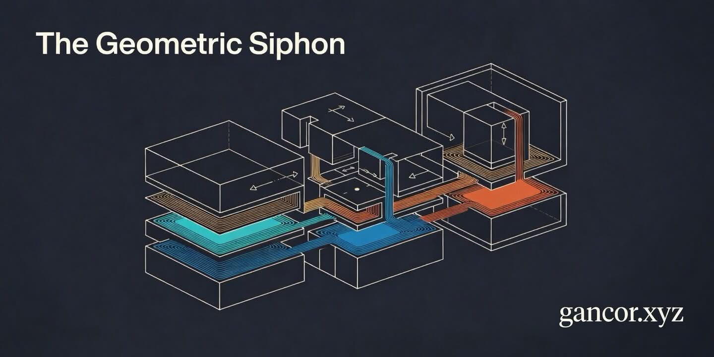

<p align="center">
  
</p>

# The Geometric Siphon

Paper sources, Foundry verification code, and reproduction scripts for the *Geometric Siphon* papers (K. R. Ryan, 2026).

The *Geometric Siphon* is a mechanism arising from concentrated-liquidity rebalancing geometry, made observable through shared depositor balances. When autonomously rebalanced positions share a token balance, token-ratio mismatches between old and new tick ranges route residual tokens through that shared balance, transferring capital between positions in independent pools. Six theorems characterise the mechanism (Theorems 1–3 in Paper I, Theorems 4–6 in Paper II), and a graph-theoretic *Connector Rule* relating per-pool flow to portfolio topology is stated as a conjecture. A 16-test Foundry suite verifies all six theorems against unmodified V3 contracts on Base mainnet, with six fork tests against live Aerodrome Slipstream. A 1,380-event controlled dataset and a separate 35,910-event production-scale dataset anchor the empirical results.

| | |
|---|---|
| **Author** | K. R. Ryan, independent researcher |
| **Contact** | [gancor.xyz](https://gancor.xyz) · ORCID [0009-0004-6295-7040](https://orcid.org/0009-0004-6295-7040) · code/reproduction questions via [GitHub Issues](https://github.com/g4nc0r/the-geometric-siphon/issues) |
| **Code DOI** | [](https://doi.org/10.5281/zenodo.19905208) - Foundry verification suite |
| **Data DOI** | [](https://doi.org/10.5281/zenodo.19904832) - Diffusion event log |
| **Foundry** | `forge` ≥ 1.5; Solidity 0.8.26 |
| **Python** | 3.9+, standard library only |
| **Licence** | code MIT (`LICENSE`); Zenodo data deposit CC-BY-4.0; paper PDFs and LaTeX sources © K. R. Ryan, all rights reserved |

**Status.** The consolidated manuscript in `papers/manuscript/` revises and unifies Papers I and II and is being prepared for journal submission. The SSRN preprints below remain the citable record.

## Papers

| Version | Where | Status |
|---|---|---|
| Paper I: Emergent Capital Reallocation in Concentrated Liquidity Portfolios | [SSRN 6374838](https://papers.ssrn.com/sol3/papers.cfm?abstract_id=6374838); source in `papers/ssrn/` | Live preprint |
| Paper II: Directional Properties | [SSRN 6481498](https://papers.ssrn.com/sol3/papers.cfm?abstract_id=6481498); source in `papers/ssrn/` | Live preprint |
| Geometric Siphon (consolidated) | [SSRN 6686798](https://papers.ssrn.com/sol3/papers.cfm?abstract_id=6686798); source in `papers/ssrn/` | Live preprint |

## Citation

Cite the SSRN preprints. Paper I covers Theorems 1–3 and the §5 empirical work; Paper II covers Theorems 4–6.

```bibtex
@techreport{ryan2026siphon1,
  author      = {Ryan, K. R.},
  title       = {The Geometric Siphon: Emergent Capital Reallocation in
                 Concentrated Liquidity Portfolios},
  institution = {SSRN},
  number      = {6374838},
  year        = {2026},
  url         = {https://papers.ssrn.com/sol3/papers.cfm?abstract_id=6374838}
}

@techreport{ryan2026siphon2,
  author      = {Ryan, K. R.},
  title       = {The Geometric Siphon II: Directional Properties},
  institution = {SSRN},
  number      = {6481498},
  year        = {2026},
  url         = {https://papers.ssrn.com/sol3/papers.cfm?abstract_id=6481498}
}
```

A `CITATION.cff` with the same metadata is included at the repository root.

## Quick start

```bash
# Foundry suite (16 tests, ~3s mock + ~1min fork)
cd foundry
git submodule update --init --recursive
RPC_BASE_ALCHEMY=https://mainnet.base.org forge test
# expected: Suite result: ok. ... 16 tests passed, 0 failed, 0 skipped

# Reproduce paper tables from the Zenodo data bundle
cd reproduction
python3 run_all.py
# expected: 13 markdown tables matching paper Tables 8–23
```

The reproduction harness reads from JSONL event logs that ship in the Zenodo data deposit. Run from inside the unpacked deposit, or download the deposit and place the JSONLs alongside `reproduction/`.

## Layout

```
.
├── papers/
│   ├── manuscript/             consolidated working draft (.tex, .pdf, .cls, .bst, .bib)
│   └── ssrn/                   sources of the live SSRN preprints + figures
├── foundry/                    Foundry verification suite (16 tests, 5 contracts)
│   ├── src/                      MockCLPool.sol, MockCLPoolV2.sol
│   ├── test/                     5 test contracts + helpers/ + interfaces/
│   ├── PROOF_OUTPUT.md           captured forge test output
│   └── README.md
├── reproduction/               13 Python scripts that regenerate paper tables
│   ├── README.md
│   ├── _common.py
│   ├── run_all.py
│   └── tableN_*.py
├── CITATION.cff
├── LICENSE
└── README.md
```

## Foundry verification suite

16 tests across 5 contracts cover the six theorems and the §7.1 architectural precondition. Test-to-section mapping is in [`foundry/PROOF_OUTPUT.md`](./foundry/PROOF_OUTPUT.md); a per-contract description is in [`foundry/README.md`](./foundry/README.md).

```bash
cd foundry
git submodule update --init --recursive   # first time only

# Mock-pool tests only, no network access required (10 tests)
forge test -vv --no-match-contract '(GeometricResidualProof|DirectionalExitForkProof)$'

# Full suite, including 6 live fork tests against Aerodrome Slipstream on Base (16 tests)
RPC_BASE_ALCHEMY=https://mainnet.base.org forge test -vv
```

Any Base RPC URL with archive support works in `RPC_BASE_ALCHEMY`. The fork tests are pinned to Base block `43_175_000` (2026-03-10 10:42 UTC, mid-Phase 2 of the paper's data window), so captured numerical residuals are bit-reproducible. Forge caches RPC responses under `~/.foundry/cache`, so repeat runs are fast.

## Reproducing the paper's tables

[`reproduction/`](./reproduction/) contains 13 Python scripts that regenerate every numerical table in the paper from the bundled data files. Per-script coverage and snapshot conventions are in [`reproduction/README.md`](./reproduction/README.md).

```bash
cd reproduction

# Run all 13 tables (~60s on a modern laptop)
python3 run_all.py

# Run a single table
python3 table11_directional.py
```

The data files (diffusion-event JSONLs and supplementary caches) are not in this repository. They are deposited on Zenodo at <https://doi.org/10.5281/zenodo.19904832>; download the archive and place its contents alongside `reproduction/` to run the harness.
